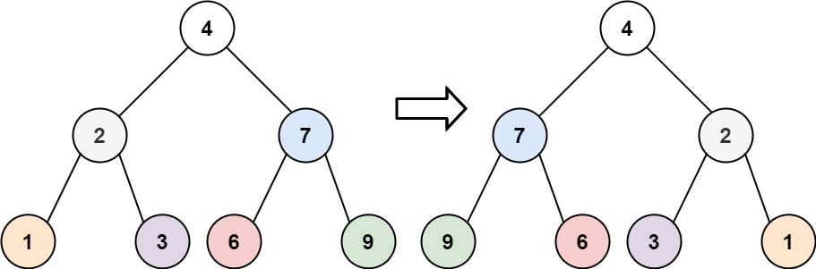

# 226

# My Solution
In my solution, I tried to implement DFS to reach all of paths. Then swap them by adding to a new tree called new_t.

I can implement it by myself, but after reading others' solutions, I found my method is too complex and waste space.

I do not need to create a new tree to do the swap task, only to swap exist tree, for example:

2 will swap with 7, then their children will be swapped to left and right side! So, `(6, 9)` will be in left with `7`, then we just swap to `(9,6)` in the same way (add to stack if we use DFS).

The improved implementation can be found in `226-recursive-fs-bs.py`.

# Re-do notes (DFS)
thoughts:
1. 首先看到這題，我覺得必須iterate過一次tree, 才能夠做到inverse. 所以直覺就會是可以用BFS or DFS去做
2. 接著要去想，我要怎麼讓兩邊去對調，我一開始想的方法是只去對調val, 但這樣會造成他們底下的sub-tree沒有被正確對調過去，所以必須對調整個結構，直到最底下的leaf
3. 再深入去想，其實我們只需要不斷的對調左右, 並且在把接下來要做的子節點放到stack中，依序不斷對調，其實不論使用BFS or DFS去iterate, 都是一直去幫所有節點的子節點左右對調，最終結果都會是inverse正確的，只要確定每個節點都有做到即可

drawbacks:
- 我卡在要怎麼把整個都對調，變成完全相反狀態，想了一陣子才想到要將目前找到的node直接對調，一直iterate下去，他們原本下面的子節點才會一直跟著上面去動
- 接著我在想用DFS從後進的先出來跑對調會不會有問題。其實不會，因為就算子節點先換好了，網上一個父節點再去處理對調時，因為下面已經處理好了，所以上面對調，他下面的結果會跟著父節點動，所以一樣是對的 (跟著algorithm dry-run就可以懂了！)