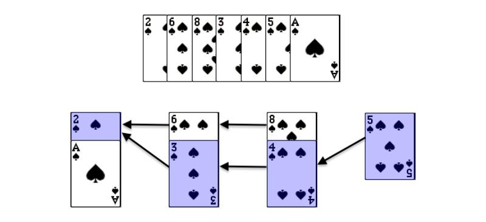

# 300

## DP Solution
I can imagine that this question should be addressed by DP, but I cannot find the relationship between the numbers.
So I refer to discussion and try to implement in my thoughts.

Here is my thoughts:
if input is `[1,3,6,7,9,4,10,5,6]`, and the result should be 6 due to 1,3,6,7,9,10 is the longest increasing sub-array from the input.
1. we can init a DP array in `len(nums)` and init all as `1`, e.g., `[1,1,1,1,1,1,1,1,1]` for store the current increasing sub-array max length
2. compare `range(1, len(nums))` -> `ind` with `range(0, i)` -> `k`, if `ind > k`, we just need to add `1` with `dp[k]` due to we find a increasing sub-array from now! 
Let's dive into solution with input.
```python
# input
[1,3,6,7,9,4,10,5,6]
# init dp
[1,1,1,1,1,1,1,1,1]
# compared dp
[1,2,3,4,5,3,6,4,5]
3 => 3>1, so 1+1
6 => 6>1 and 6>3, so max(1+1, 2+1) => 3
7 => 7>1 & 7>3 & 7>6, max(1+1, 2+1, 3+1) => 4
9 => 9>1 & 9>3 & 9>6 & 9>7, max will be 4+1 => 5
4 => 4>1 & 4>3, max=2+1 => 3
10 => 10>1,3,6,7,9,4. max=5+1 => 6
5 => 5>1,3,4. max=3+1 => 4
6 => 6>1,3,4,5. max=4+1 => 5

So, we can get the longest sub-array from the max of dp list
```

## Greedy with Binary Search
This solution can enhance time complexity to `O(NlogN)`
https://leetcode.com/problems/longest-increasing-subsequence/solutions/1326308/c-python-dp-binary-search-bit-segment-tree-solutions-picture-explain-o-nlogn

Let's see the diagram from @hiepit:

This can explain why we can use this rule to get the longest sub-array.
we greedy list out all of possible sub-array from `nums = [2, 6, 8, 3, 4, 5, 1]`:
```
[2,6,8]
[2,3,4,5]
[1]
```
Then we can find if we replace the smallest element >= current number, we can get the longest sub-array. It is not easy to find out the relationship but it can efficiently decrease the time complexity from O(N^2) to O(NLogN)