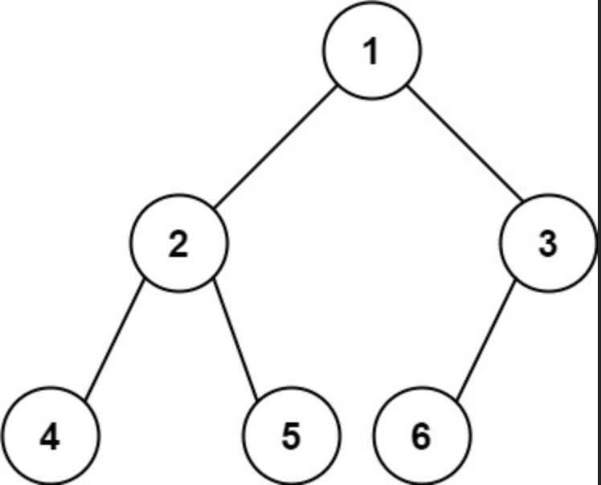

# 222. Count Complete Tree Nodes
Label:binary tree, recurison

This question cannot be solved by myself. I got confused when I saw this problem, and I have no idea with complete binary tree, so I did not relate to a complete tree will have 2^n nodes.

After referred to others solution, by comparing depth among left tree and right tree, we can find that if left depth same to right depth, it means left tree is complete binary tree definetly.
Instead, right tree is complete binary tree absolutely. (in spite of its depth is shorter then left one.)

E.g., if depth is the same like this:

The left tree muse be complete binary tree, and its depth is 2, so it will have 2^2=4 in the left tree. The we just need to calculate the remaining right tree by recursion.