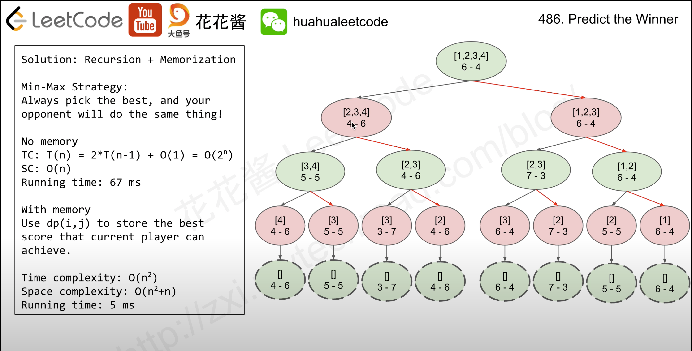

# 486. Predict the Winner
tag: `recursion`, `memorization`, `dp`

I have no idea when I saw this question, but I can only imagine this is a recursion problem.
So I referred to the 花花醬 for the instruction.

## Recursion

The key point is each competitor would like to kick others out in their round. So, they would choose the maximum always. As a result, we can calculate the difference from p1 to p2, and use backtracking recurssion to calculate.

And the solution calculated the difference from p1 to p2, at the end, p1 should >= p2 for winning.
Besides, due to if anyone choose the left index, next would only can choose (l+1, r). In the other hand, if choose right index, next would only have (l, r-1).
And each step would change the view of competitor. For example, in round 1, p1 choose the number, p1 will want to win, so it minus opposite. And round 2, p2 want to crack p1, so it minus p1 and choose the maximum for winning.

If I confuse to this question again, I suggest to watch this tutorial again: 

## Recursion with memorization
We can found that in some situations, we will get the same (l,r) pairs. So, we can utilize memorization mechanism to store the data to specific key. For example, here we calculate `l*len(nums)+r` to calculate key, if l, r pairs is the same, key will be the same either.

So we can directly return answer from dictionary with O(1).